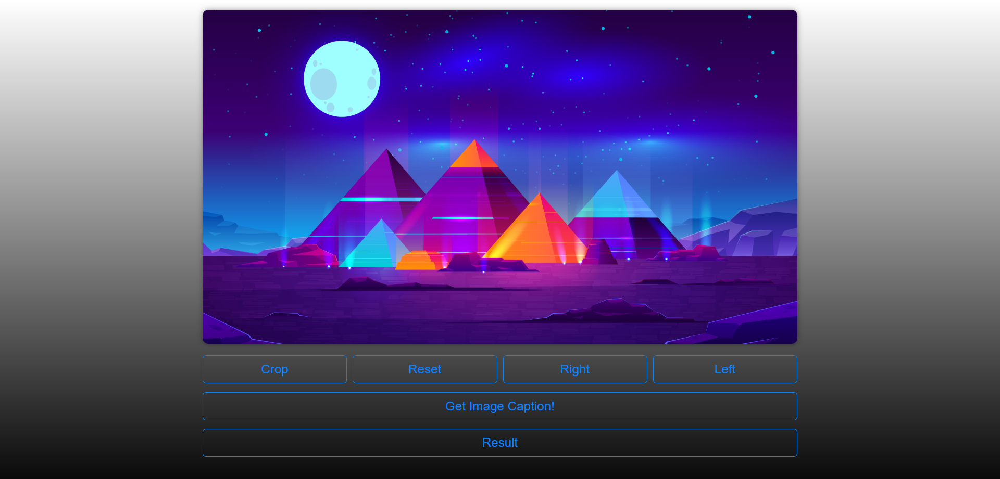
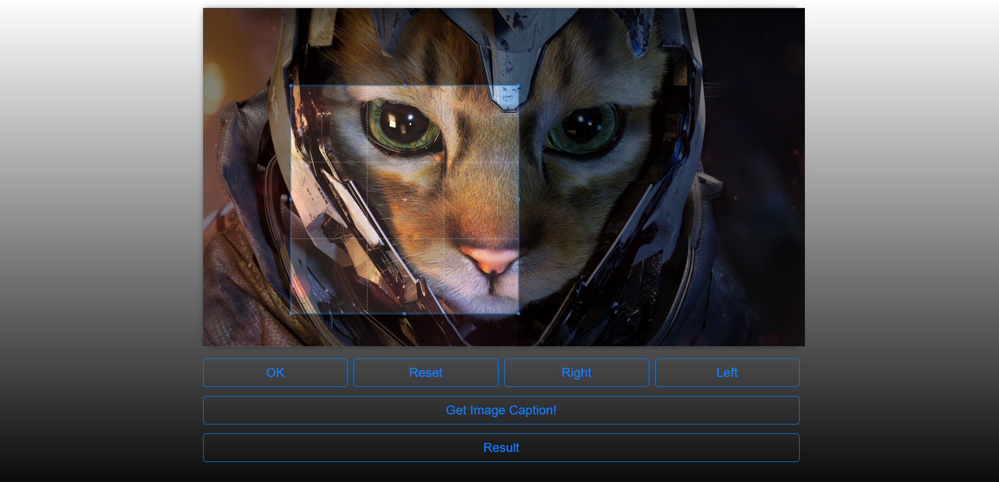
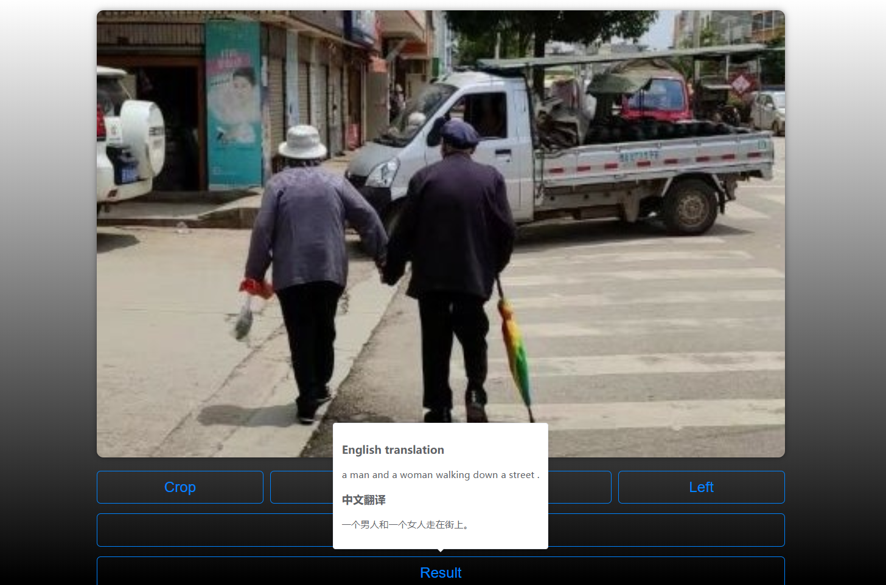
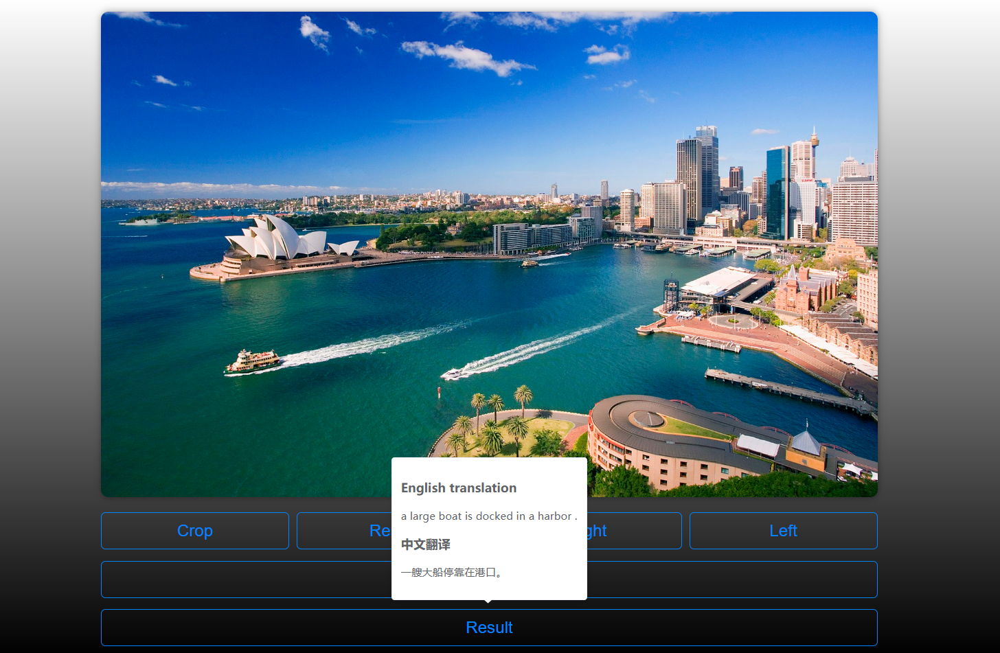
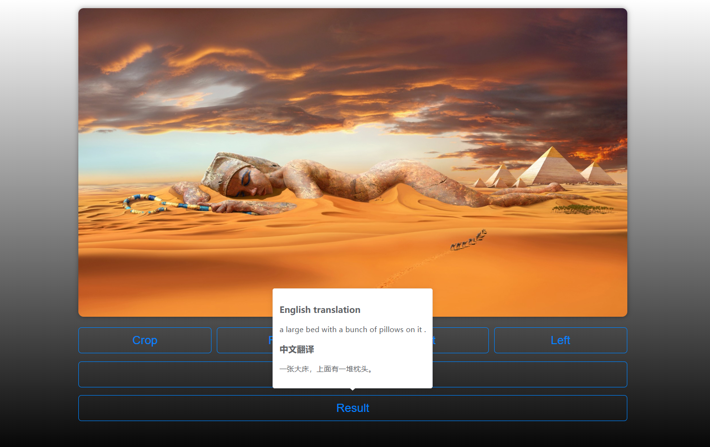
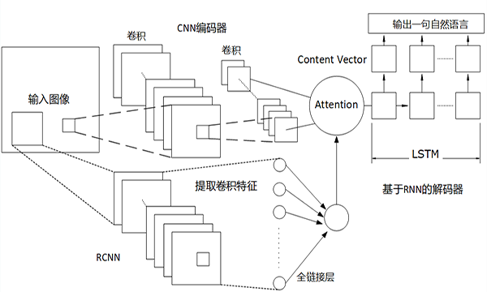

### MyImageCaption

该项目是致力于自动生成任意图片的文字描述

图像是人类获取信息的重要渠道，机器自动识别图像提取关键信息的能力是人工智能的一个重要研究课题，吸引大量的AI研究者通过对交叉领域不断探索新的研究机会。本文针对当下搜索引擎图像识别结果对搜索排名存在模糊不精准的影响，基于深度卷积神经网络(Deep 
Convolutional Neural Network，DCNN)的目标检测和循环神经网络(Recurrent Neural 
Networks，RNN)语言学习，将机器视觉和自然语言结合，设计并实现通过图像识别提取关键字与细节描述生成对该图像的自然语言描述的模型，该模型分为特征提取层和自然语言生成层。本文通过大量的数据训练将搜索引擎排名精确度提升，对视频自动生成摘要，并着手研究将该技术运用到盲人眼镜中，通过捕捉图像进行翻译处理后生成自然语言向视力障碍者描述图像内容，降低视觉障碍者在社会重的思想文化及情感交流障碍，具有很大的社会公益性。

#### 演示界面：

实现了裁剪功能：

#### 测试用例和结果：

>由于训练数据为微软的Coco数据集，其为英文数据集，中文是Google翻译而来的，可能会出现翻译不准确的情况，所以测试以英文为准

自然生活图片：

识别结果：

**A man and a woman walking down a street .**

**一个男人和一个女人走在街上**

---

---

识别结果：

**A large boat is docked in a harbor **

**一艘大船停靠在港口**

悉尼歌剧院被识别成了大船

---

非自然艺术图片：

识别结果：

**A large bed with a bunch of pillows on it .**

**一张大床，上面有一堆枕头**

Coco数据集大都为基本的生活照图片，所以对待这种非自然艺术图片时会不准确。

####  整个神经网络模型的架构为：

